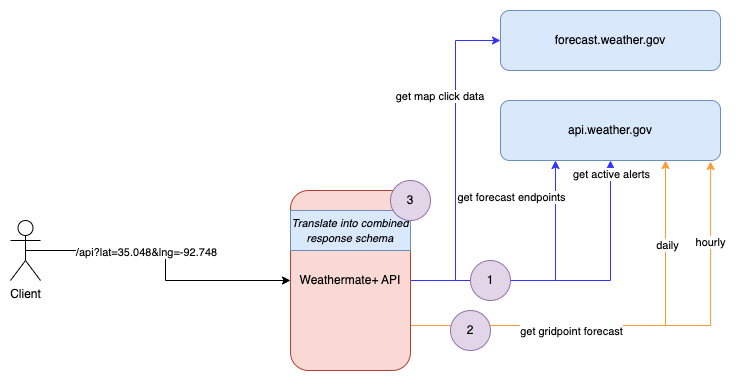

## Weathermate+ API

Welcome to our API! This was created to provide a single HTTP request to get current observations, seven day forecasts, and hourly forecast data, along with active alerts, from the National Weather Service (NWS) of the United States of America. 

To get the following data from the National Weather Service, there are several http requests needed, so we decided to combine them into a single call and provide a better response for end users to consume. 

We take latitude and longitude as query parameters and then:



1. Combine the calls to forecast and api weather.gov endpoints.
2. Get the forecasts for the gridpoint returned. Both daily and hourly.
3. Translate all of this into an easy to consume response.

### How to use

GET request

```bash
curl -X 'GET' \
  'https://weathermateplus.com/api/?lat=35.078&lng=-92.048' \
  -H 'accept: application/json'
```

### Documentation

[Swagger UI](https://weathermateplus.com/api-documentation)